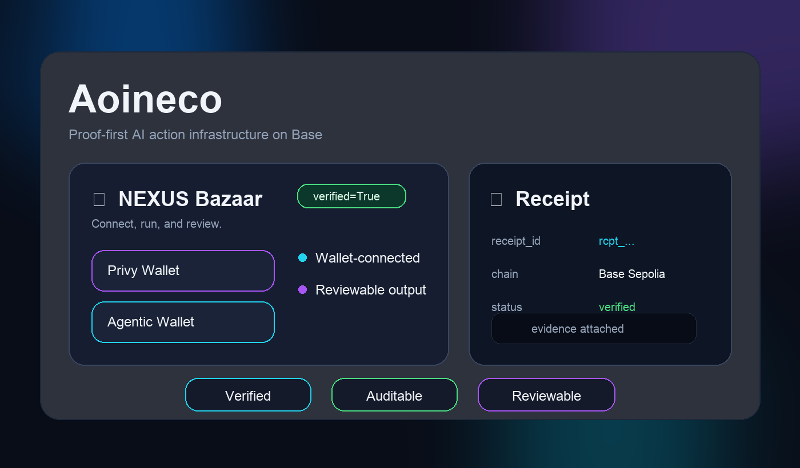

# Aoineco Base Batches Demo

**Proof-first AI action infrastructure on Base.**

**Base gives agent actions a composable path from execution to evidence.**

**Explore The Archive:** https://archive.aoineco.ai/  
**Company intro video:** https://youtu.be/Pv3H2Cenu2A

Aoineco helps AI-assisted workflows produce **verified actions**, **auditable evidence**, and **reviewable outputs** — not just opaque automation logs.

Many AI systems can generate outputs. Some can take actions. Very few can clearly show **what happened, whether it succeeded, and how the result should be reviewed**. This repository is the public demo slice of Aoineco’s answer to that problem.

> AI actions should not only run — they should leave behind evidence.



*Proof-first demo flow: connect, run, verify, review.*

---

## What makes this different

Many AI demos focus on what a model can say.  
Aoineco focuses on what an AI-assisted workflow can **prove**.

That means designing around:

- **verification**, not just output
- **evidence**, not just claims
- **reviewability**, not just automation
- **operational truth**, not just happy-path demos

We are less interested in black-box execution and more interested in building workflows that can be **checked, interpreted, and trusted**.

---

## Why this matters

As AI-assisted systems move into real workflows, trust becomes a product requirement.

If an AI-assisted process cannot be checked after the fact, then users, collaborators, and evaluators are left with a black box. That becomes especially problematic when actions matter more than generated text.

Aoineco is being built around a simple principle:

- important actions should be **verifiable**
- outcomes should be **human-readable**
- failures should be **interpretable**
- evidence should be **preserved**

In short: execution without evidence is not enough.

---

## What this demo shows

This repository focuses on a narrow, reviewable slice of the broader product direction. For the broader product surface, see **The Archive**: https://archive.aoineco.ai/


- a Base-oriented demo app
- wallet-connected user flow
- dry-run and read-only execution paths
- structured execution receipts
- verification-friendly endpoints
- an early path toward accumulated verified outcomes

This is not a claim of full product completeness. It is a public, inspectable demo of a larger thesis:

**AI-assisted execution should produce proof, not just output.**

---

## Judges Quickstart

If you only have a few minutes, focus on these:

1. **Core idea**  
   Aoineco is about **verified actions** and **evidence-first execution**

2. **Verification evidence**  
   Community testing produced multiple successful verified cases, including a retry-resolved case that informed our operational logic

3. **Trust model**  
   We are building toward a system where AI-assisted actions produce outputs that are reviewable, portable, and eventually archiveable

4. **Why Base**  
   Base is the practical foundation we see for composable, trust-oriented execution history

### Run locally

```bash
npm install
npm run bridge
npm run dev
```

### Verify the core idea

```bash
curl -sS -X POST http://localhost:3098/api/demo/runverify \
  -H "content-type: application/json" \
  -d '{}'
```

Expected result shape:

- a `receipt_id`
- a verification result
- a structured evidence payload

You can also inspect:

- `GET /api/core/workflows`
- `POST /api/core/verify`
- `examples/sample_execution_receipt.json`

The point of the repo is not only UI. The point is that a run should leave behind something inspectable.

---

## Verification Evidence

We collected evidence for **9 successful verified cases** through community testing.

### Highlights

- **9 successful verification outcomes**
- **1 retry-resolved case**: an initial `502` gateway error was later resolved, ending in `verified=True`
- This helped us distinguish between **transient infrastructure failure** and **true verification failure**

### Why this matters

This was not a purely theoretical design decision.

It came from real testing, real retries, and real review of outputs. That experience reinforced an important product principle:

> evidence matters more than assumptions

In practice, this means Aoineco is being shaped around operational reality, not just ideal demo conditions.

For supporting material, see:

- `VERIFIED_EVIDENCE_SUMMARY.md`
- `EVIDENCE_LOG.md`

---

## Why Base

We see Base as the trust layer for verifiable AI-assisted workflows.

### Base gives us a practical trust foundation

- **Low-friction coordination** for fast product iteration
- **Composable public infrastructure** for verification-oriented systems
- A path from workflow outputs to **reviewable, attestable history**
- A strong builder environment for products where credibility matters as much as functionality

We do not see Base simply as somewhere to deploy an app.

We see it as a place where **AI-assisted actions can become more accountable over time**.

---

## Built through iteration

Aoineco did not come from a single isolated prototype.

It has been shaped through repeated hackathon iteration, community testing, troubleshooting, and learning how to make systems easier to evaluate, not just easier to build.

Over roughly a month, our 12-agent team, led and orchestrated by a non-developer founder, participated in multiple hackathon cycles and learned that strong projects are not only technically interesting. They are also **legible, reproducible, and credible under evaluation pressure**.

That learning strongly shaped our current direction.

Our broader experimentation has also included Base-native coordination across a company wallet, individually provisioned Privy wallets for team members, and ACP-linked wallets used for role-based skill selection, purchasing, and analysis. This was not just transaction activity for its own sake: it led to **ACP Dispatch**, a GitHub-published markdown reporting format that helps both humans and agents review ACP skill information more efficiently.

---

## Current scope vs. broader vision

| Layer | What exists now | What comes next |
|------|------------------|-----------------|
| **Current repo** | demo app, wallet flow, dry-run / read-only execution, receipts, verification endpoints | stronger reviewer packaging, clearer proof surfaces, better Archive presentation |
| **Near-term product step** | limited AOI PRO beta with external testers | early Archive experience, visible verified outcome accumulation, small live Base transactions |
| **Long-term vision** | proof-first execution model | **The Archive** — a trustworthy history of verified work |

---

## Public endpoints worth checking

Read-only / demo-oriented endpoints include:

- `GET /api/core/workflows`
- `POST /api/demo/runverify`
- `POST /api/core/verify`
- `GET /api/aggregator/search?q=...`

These matter because they expose the repo’s core thesis more directly than UI alone:

**a run should produce something verifiable.**

---

## Reviewer guide

If you only inspect a few things, inspect these:

- `README.md`
- `SUBMISSION_SUMMARY.md`
- `VERIFIED_EVIDENCE_SUMMARY.md`
- `examples/sample_execution_receipt.json`
- `server.js`

---

## Repository guide

- `README.md` — reviewer entry point
- `ARCHITECTURE.md` — current technical structure
- `SUBMISSION_SUMMARY.md` — submission-facing summary
- `VERIFIED_EVIDENCE_SUMMARY.md` — validated usage, participation, and verification notes
- `EVIDENCE_LOG.md` — evidence index and supporting notes
- `SUBMISSION_CHECKLIST.md` — packaging checklist
- `examples/sample_execution_receipt.json` — sanitized reviewer sample
- `server.js` — bridge + proof / verification demo endpoints
- `src/` — frontend demo app
- `default_workflows.json` — public workflow registry

---

## Acknowledgments

Huge thanks to these community members for their help with verification testing, troubleshooting, and evidence collection  
*(all handles below are X / Twitter accounts)*:

- @odeto0504
- @dongsu
- @LastMoney6489
- @chochunja77
- @Yhalresearch
- @Koreanguy_
- @sky314pi
- @kwondoyun80
- @seok_brc

---

## Submission positioning

For application purposes, describe this repo as:

> A public demo of Aoineco’s proof-first AI infrastructure direction, showing how agent actions can produce structured, auditable, and reviewable receipts instead of unverifiable black-box behavior. The broader product surface is **The Archive** (https://archive.aoineco.ai/), where that proof-first direction becomes a user-facing trust layer.

---

## License

Proprietary — Aoineco & Co. All rights reserved.
